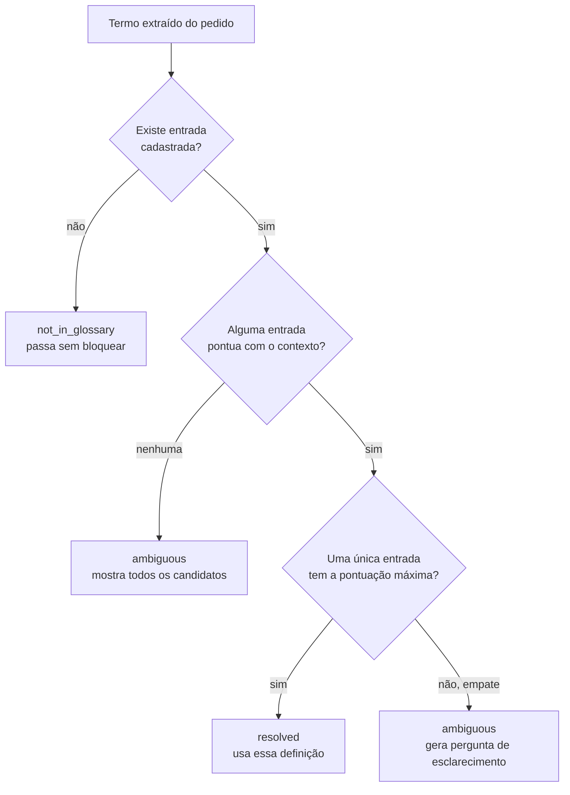
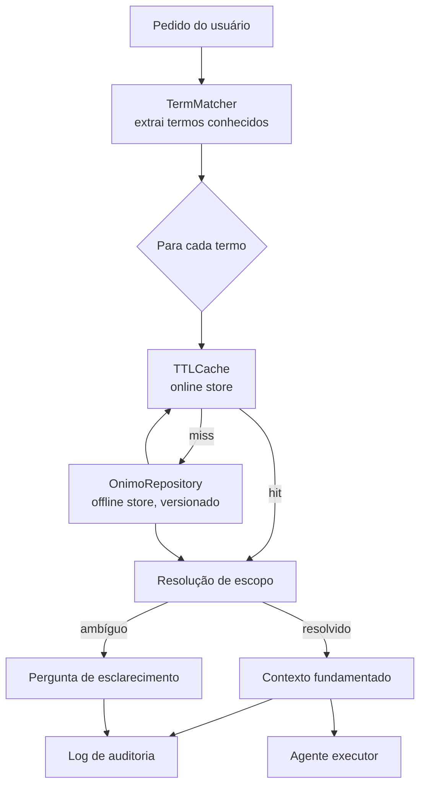

# Onimos: um feature store para o significado de palavras em contexto

## 1. Motivação

Agentes de IA recebem um pedido em linguagem natural e aplicam uma tarefa sobre esse pedido sem ter garantia nenhuma de que entenderam os termos do domínio da forma que o sistema espera. O exemplo que deu origem a este projeto é direto: um pedido como "liste os clientes" pode significar coisas diferentes dependendo de onde ele é feito. No módulo de vendas, cliente é quem já comprou. No módulo de parcerias, cliente pode ser o revendedor que compra para revender, não para consumir. Um agente que resolve "cliente" sempre do mesmo jeito, em qualquer contexto, vai acertar na maior parte dos casos e errar silenciosamente nos outros — e o erro silencioso é o pior tipo de erro, porque ninguém percebe até o dado sair errado em algum relatório.

Esse problema tem nome fora do mundo de agentes de IA: é o problema do vocabulário, ou polissemia de termos de domínio, bem conhecido em sistemas de NLU empresarial e em ferramentas de texto-para-SQL. A solução estabelecida nesses sistemas é uma camada semântica — um glossário de negócio que fica entre o pedido do usuário e a execução da tarefa, resolvendo o que cada termo significa antes de deixar o agente agir.

Este documento descreve o Onimos, uma implementação dessa camada pensada explicitamente como um **feature store de significado**: em vez de um dicionário chave-valor estático, um registro versionado, com separação entre leitura rápida e histórico auditável, e um motor de resolução que decide quando é seguro resolver automaticamente e quando é preciso perguntar.

## 2. O conceito: por que "feature store" e não "glossário"

Um feature store de machine learning existe para resolver um problema estrutural: sem ele, times diferentes calculam a mesma métrica de formas diferentes, e um modelo em treino acaba vendo um valor diferente do que o mesmo modelo vê em produção — o chamado training-serving skew. A solução é centralizar a definição da feature num registro único, com dono, versão, e dois modos de servir o dado: um armazenamento offline, com histórico completo, usado para treino e auditoria; e um armazenamento online, otimizado para latência baixa, usado para servir a mesma feature em tempo real.

O mesmo problema estrutural existe para significado de palavra. Sem um registro central, cada time interpreta "cliente ativo" à sua maneira, cada pipeline de dados aplica sua própria regra, e um agente de IA que consome esses dados herda a inconsistência sem saber que ela existe. A diferença é que aqui a "feature" não é um número — é uma definição em texto, associada a um escopo (módulo, papel do usuário, tenant) que diz em qual contexto aquela definição vale.

O nome onimos vem do sufixo grego -ônimo (nome), o mesmo presente em sinônimo, hipônimo e homônimo. Cada palavra do domínio (o lema, como "cliente") pode ter vários onimos — vários sentidos possíveis — e o papel do sistema é decidir qual onimo se aplica a um pedido específico.

A tabela abaixo resume a correspondência entre os dois mundos:

| Feature store | Onimos |
|---|---|
| Feature (nome + lógica de cálculo) | Onimo (um sentido específico de uma palavra) |
| Entidade (cliente, pedido) | Lema — a palavra em si ("cliente", "ativo") |
| Feature group | Conjunto de onimos de um mesmo lema |
| Catálogo/registro de features | `OnimoRepository` |
| Online store (baixa latência) | `TTLCache` na frente do repositório |
| Offline store (histórico, treino) | Histórico versionado dentro do próprio `OnimoRepository` |
| Point-in-time correctness | Mesmo princípio: resolução correta pra uma data passada |
| Feature monitoring / drift | Taxa de ambiguidade, taxa de correção humana, termos em desuso |

## 3. Estrutura de dados

### 3.1 OnimoEntry

Cada sentido possível de um termo é representado por uma `OnimoEntry`:

```python
@dataclass
class OnimoEntry:
    id: str
    term: str
    definition: str
    scope: dict[str, str]
    excludes: list[str]
    version: int
    valid_from: datetime
    valid_to: datetime | None = None

    def is_current_at(self, as_of: datetime) -> bool:
        return self.valid_from <= as_of and (self.valid_to is None or as_of < self.valid_to)
```

- `term` é o lema em minúsculas, a chave de agrupamento.
- `scope` é um dicionário livre de sinais de contexto — `{"modulo": "vendas"}`, `{"modulo": "vendas", "role": "analista"}`, ou vazio para uma definição genérica. É esse campo que separa este modelo de um dicionário chave-valor plano: em vez de uma definição por termo, existem várias, cada uma marcada com a condição em que se aplica.
- `excludes` guarda, como lista de strings, o que aquela definição deliberadamente não cobre — por exemplo, "cliente" no módulo de vendas exclui "revendedores". Hoje isso é só texto solto, não uma referência estruturada a outro onimo; a seção 8 discute por que isso é uma simplificação deliberada, não a forma final.
- `version`, `valid_from` e `valid_to` formam o mecanismo de versionamento. Uma entrada nunca é editada in-place: quando a definição de um termo muda, a entrada antiga recebe `valid_to` e uma nova é criada com `version` incrementado. `is_current_at(as_of)` é o que permite perguntar "qual era a definição vigente numa data qualquer", não só "qual é a definição agora".

### 3.2 OnimoRepository

O repositório agrupa entradas por termo e mantém um contador de versão global (`watermark`) usado por outras partes do sistema para saber quando o vocabulário mudou:

```python
class OnimoRepository:
    def __init__(self):
        self._by_term: dict[str, list[OnimoEntry]] = {}
        self._lock = threading.RLock()
        self._watermark = 0
```

A implementação atual guarda tudo em memória, protegida por um `RLock` para segurança em ambiente com múltiplas threads. Em produção, isso corresponde à camada offline de um feature store — normalmente uma tabela num banco relacional, versionada da mesma forma. Trocar a implementação por Postgres significa reimplementar `get_candidates` e `add_version` com queries reais; nenhuma outra parte do sistema depende de como o dado é armazenado, só da interface.

### 3.3 O que falta para ser uma ontologia de verdade

O nome do projeto promete ontologia, mas a estrutura implementada é uma lista de entradas por termo, sem relação nenhuma entre elas. Um modelo ontológico completo trataria cada onimo como um nó de grafo, com arestas tipadas para outros onimos:

- **é-um / generaliza**: "cliente ativo" herdaria a definição base de "cliente" e só adicionaria a restrição de tempo, em vez de duas entradas independentes que por acaso compartilham parte do texto.
- **exclui**: o campo `excludes`, hoje uma lista de strings soltas, viraria uma aresta real para outro onimo cadastrado — o que permite, por exemplo, alertar se alguém tenta cadastrar uma exclusão para um termo que não existe.
- **mesmo-que**: sinônimos dentro de um domínio ("cliente ativo" e "cliente engajado" usados por times diferentes) apontariam para o mesmo onimo em vez de duplicar a definição em dois lugares.

Com essas arestas, o motor de resolução deixaria de depender só de correspondência de escopo (seção 5) e passaria a poder subir a hierarquia: se não existe onimo de "cliente" para `modulo=suporte`, buscar o onimo pai mais genérico em vez de exigir uma entrada cadastrada manualmente para cada módulo novo. Isso generalizaria o mecanismo de fallback que hoje é feito à mão, com uma entrada de escopo vazio por termo. A implementação atual é o caso de uso mínimo que já resolve o problema original; o grafo é a extensão natural quando o número de lemas e relações justificar a complexidade adicional.

## 4. Algoritmo de escrita

Escrever uma nova definição nunca sobrescreve a anterior — fecha a versão vigente e abre uma nova:

```python
def add_version(self, term, definition, scope, excludes=None, as_of=None):
    as_of = as_of or datetime.now(timezone.utc)
    term = term.lower()
    with self._lock:
        existing = self._by_term.setdefault(term, [])
        same_scope = [e for e in existing if e.scope == scope and e.valid_to is None]
        next_version = 1
        for e in same_scope:
            e.valid_to = as_of
            next_version = e.version + 1
        entry = OnimoEntry(
            id=uuid4().hex[:12], term=term, definition=definition, scope=scope,
            excludes=excludes or [], version=next_version, valid_from=as_of, valid_to=None,
        )
        existing.append(entry)
        self._watermark += 1
        return entry
```

O algoritmo localiza, dentro das entradas já existentes para aquele termo, qualquer uma com o mesmo `scope` e ainda vigente (`valid_to is None`), fecha essa entrada e cria a próxima versão. O custo é proporcional ao número de versões já existentes para aquele termo — na prática, um número pequeno, já que um termo raramente acumula dezenas de redefinições. A escrita nunca é destrutiva: apagar informação exigiria uma operação separada e deliberada, que o sistema atual não expõe.

Esse comportamento é o que garante correção ponto-no-tempo. Um exemplo real, rodado sobre o próprio repositório:

```python
t_old = datetime.now(timezone.utc) - timedelta(days=30)
repo.add_version("ativo", "Cliente que comprou nos últimos 90 dias.", {"modulo": "vendas"}, as_of=t_old)
repo.add_version("ativo", "Cliente que comprou nos últimos 60 dias.", {"modulo": "vendas"})
```

Consultando a definição vigente agora, o resultado é "Cliente que comprou nos últimos 60 dias." Consultando a definição vigente 29 dias atrás (`as_of=t_old + timedelta(days=1)`), o resultado é "Cliente que comprou nos últimos 90 dias." — a definição antiga, preservada, mesmo depois de uma atualização. Um log de auditoria gerado há um mês continua fazendo sentido, porque aponta para o `id` da versão que estava vigente naquele momento, não para o estado atual do repositório.

## 5. Algoritmo de leitura

Ler significa duas coisas separadas: buscar as entradas candidatas de um termo, e decidir qual delas se aplica ao contexto atual.

### 5.1 Busca de candidatos

```python
def get_candidates(self, term, as_of=None):
    as_of = as_of or datetime.now(timezone.utc)
    with self._lock:
        entries = self._by_term.get(term.lower(), [])
        return [e for e in entries if e.is_current_at(as_of)]
```

Um lookup direto no dict por termo, seguido de um filtro por vigência temporal. Sem `as_of`, o filtro usa o instante atual — é o caminho de leitura "normal", coberto pelo cache (seção 7). Com `as_of` explícito, o filtro usa a data pedida — o caminho de auditoria, que sempre vai direto ao repositório, sem cache.

### 5.2 Resolução de escopo

Encontrados os candidatos, o agente decide qual se aplica pontuando cada entrada pelo número de chaves de escopo que batem com o contexto atual:

```python
@staticmethod
def _match_score(entry, context_signals):
    score = 0
    for key, value in entry.scope.items():
        if key not in context_signals or context_signals[key] != value:
            return None
        score += 1
    return score
```

Uma entrada com `scope={"modulo": "vendas"}` só pontua se o contexto atual tiver `modulo="vendas"`; qualquer outra coisa desqualifica a entrada (`None`). Uma entrada com `scope={}` sempre pontua, com score zero — funciona como fallback, e só vence quando nenhuma entrada mais específica se aplica.

A partir das pontuações, a lógica de decisão segue quatro caminhos:



O ponto central desse desenho é que ambiguidade nunca é resolvida por adivinhação. Quando duas entradas empatam em especificidade, ou quando nenhuma bate com o contexto disponível, o termo é sinalizado, não resolvido por um critério arbitrário como "a primeira da lista" ou "a mais usada historicamente".

## 6. Algoritmo de busca (extração de termos no texto)

Antes de resolver qualquer termo, é preciso encontrar quais termos do pedido do usuário aparecem no vocabulário cadastrado. Essa etapa passou por duas implementações.

### 6.1 Primeira tentativa: regex por termo

A versão inicial comparava o texto contra cada termo do glossário, um regex por vez:

```python
for term in glossary.terms():
    if re.search(r"\b" + re.escape(term) + r"\b", text_lower):
        found.append(term)
```

O custo dessa abordagem é proporcional ao tamanho do vocabulário, não ao tamanho do texto — cada pedido do usuário dispara uma varredura no glossário inteiro. Com trinta termos isso é irrelevante. Medido com 5000 termos sintéticos, o custo médio por extração ficou em torno de **255 ms**.

### 6.2 Segunda tentativa: automaton Aho-Corasick

Para tirar a dependência do tamanho do vocabulário, o glossário inteiro foi compilado uma vez num automaton (uma estrutura de trie com fail-links, processada caractere a caractere), reduzindo o custo de busca para o tamanho do texto, independente de quantos termos existem no glossário. O ganho de leitura foi de ordens de grandeza — de 255 ms para cerca de **0,01 ms** por extração.

O automaton tem uma limitação prática: os fail-links dependem do vocabulário inteiro, então adicionar um único termo novo exige reconstruir a estrutura inteira. Medido: adicionar 50 termos, um de cada vez, a um glossário de 5000, custou cerca de **0,19 s** no total — a maior parte gasta reconstruindo o automaton a cada termo novo.

### 6.3 Implementação final: hash set com janela de palavras

A estrutura final abandona o automaton em favor de algo mais simples — um hash set de termos conhecidos, testado contra janelas de palavras consecutivas do texto:

```python
class TermMatcher:
    def __init__(self, terms):
        self._variant_to_term: dict[str, str] = {}
        self._max_words = 1
        for term in terms:
            self.add_term(term)

    def add_term(self, term):
        canonical = term.lower()
        for variant in self._variants(canonical):
            words = variant.split()
            self._variant_to_term[variant] = canonical
            self._max_words = max(self._max_words, len(words))

    def extract(self, text):
        words = _TOKEN_RE.findall(text.lower())
        found = set()
        n = len(words)
        for start in range(n):
            for length in range(1, min(self._max_words, n - start) + 1):
                candidate = " ".join(words[start:start + length])
                canonical = self._variant_to_term.get(candidate)
                if canonical:
                    found.add(canonical)
        return sorted(found)
```

O texto é tokenizado em palavras uma única vez. Para cada posição, o algoritmo testa a palavra isolada e, só quando ela é conhecida como início de algum termo composto, também janelas maiores — a otimização descrita na seção 6.4. `MAX_TERM_WORDS` existe porque a janela mais longa escala com esse teto: um termo de negócio real dificilmente passa de três ou quatro palavras, e a estrutura falha alto (`ValueError`) se algum termo cadastrado ultrapassar o limite, em vez de degradar silenciosamente.

A diferença entre as duas abordagens rápidas apareceu na escrita, não na leitura. Medido lado a lado, com o mesmo glossário de 5000 termos:

| | Leitura (por extração) | Escrita (50 termos novos) |
|---|---|---|
| Aho-Corasick | ~0,010 ms | ~0,16 s |
| Hash set | ~0,008 ms | ~0,005 s |

Na leitura, as duas ficam tecnicamente empatadas — a vantagem de processar por palavra em vez de por caractere é real, mas pequena em Python puro. Na escrita, o hash set é cerca de **trinta vezes mais rápido**, porque `add_term` é O(1) e não depende do resto do vocabulário, enquanto o automaton precisa recomputar os fail-links inteiros a cada termo novo. Como um glossário de negócio mantido por vários times recebe termo novo com frequência, essa diferença pesa mais no dia a dia do que a diferença marginal de leitura — por isso o hash set é a implementação final.

### 6.4 Ordenar os termos não ajuda; indexar por primeira palavra ajuda

Uma pergunta natural nesse ponto é se ordenar a lista de termos antes de inserir no hash set melhora alguma coisa. Testado (`bench_order.py`): inserir os mesmos 5000 termos em ordem aleatória, em ordem alfabética, e por tamanho decrescente, e medir a extração repetidamente. As três ordens ficam dentro da margem de ruído umas das outras — o que é esperado, já que lookup em hash set é O(1) independente da ordem de inserção. Ordenar não muda o resultado.

O que muda o resultado de verdade é indexar os termos por primeira palavra. `extract()`, como descrito acima, monta uma janela de 1 até `MAX_TERM_WORDS` palavras em cada posição do texto — mas a esmagadora maioria das palavras de um texto comum não é o início de nenhum termo composto do glossário, então montar e testar essas janelas mais longas é trabalho perdido na maior parte das vezes. A versão final guarda um conjunto separado, `_first_words`, com as palavras que de fato iniciam algum termo de mais de uma palavra, e só monta janela de 2+ palavras quando a palavra atual pertence a esse conjunto:

```python
def extract(self, text):
    words = _TOKEN_RE.findall(text.lower())
    found = set()
    n = len(words)
    for start in range(n):
        canonical = self._variant_to_term.get(words[start])
        if canonical:
            found.add(canonical)
        if words[start] not in self._first_words:
            continue
        limit = min(self._max_words, n - start)
        for length in range(2, limit + 1):
            candidate = " ".join(words[start:start + length])
            canonical = self._variant_to_term.get(candidate)
            if canonical:
                found.add(canonical)
    return sorted(found)
```

Medido (`bench_gating.py`), com um glossário de 5000 termos incluindo alguns compostos ("cliente ativo", "taxa de conversão"): a versão sem esse filtro processa a mesma frase em ~0,0125 ms; com o filtro, ~0,0041 ms — cerca de **três vezes mais rápido**, com exatamente o mesmo conjunto de termos extraídos. Não é uma troca de precisão por velocidade: o filtro só evita montar janela que, dado o vocabulário cadastrado, não tinha chance nenhuma de bater.

### 6.4 O que a extração ainda não faz

A extração atual só reconhece o que já está cadastrado no repositório — não é um reconhecedor de entidades (NER) de verdade. Um termo novo, ainda não cadastrado, não aparece na lista de termos extraídos, então nunca chega a ser avaliado; ele simplesmente não gera linha de contexto nenhuma, sem bloquear o pedido. O status `not_in_glossary`, previsto na lógica de resolução (seção 5.2, fluxograma), só é alcançável chamando `resolve_term` diretamente com um termo que se sabe estar fora do glossário — na prática de hoje, a extração nunca produz esse caso sozinha. Substituir a extração por um NER ou por uma chamada a um modelo de linguagem que devolva spans candidatos do texto livre resolveria isso sem exigir mudança em nenhuma outra parte do sistema, porque o resto do pipeline só espera receber uma lista de strings de volta.

## 7. Cache: a camada online

Na frente do repositório, um cache TTL simples faz o papel de online store — a parte do feature store otimizada para latência, não para histórico:

```python
class TTLCache:
    def __init__(self, ttl_seconds: float = 30.0, max_size: int = 50_000):
        self._data: OrderedDict[str, tuple[float, object]] = OrderedDict()
        self._lock = threading.Lock()
```

O cache é thread-safe (protegido por lock), com expiração por tempo (`ttl_seconds`) e um limite de tamanho que descarta a entrada menos recentemente usada quando excedido. Ele só participa de consultas "agora" — quando `as_of` é passado explicitamente, a leitura vai direto ao repositório, porque consulta ponto-no-tempo é rara (usada principalmente por auditoria) e não compensa cachear.

## 8. Auditoria

Toda resolução de termo, resolvida ou ambígua, gera uma entrada de auditoria através de uma interface mínima:

```python
class AuditSink(Protocol):
    def write(self, entry: dict) -> None: ...
```

A implementação padrão (`InMemoryAuditSink`) só acumula em lista, útil para teste. Em produção, a mesma interface permite trocar o destino por uma fila (Kafka, Kinesis) ou por um logger estruturado, sem que o agente precise saber qual é o destino real. Cada entrada registra o termo, o status da resolução, o contexto usado, e — quando resolvido — o `id` e a `version` exatos da entrada escolhida, não só o texto da definição. É esse detalhe que permite reconstituir, meses depois, exatamente qual definição foi usada numa execução específica, cruzando com o histórico versionado do repositório.

## 9. O agente: ContextGroundingAgent

O agente junta as peças anteriores num pipeline único, chamado antes de qualquer agente que execute a tarefa de fato.

### 9.1 Construção e automaton incremental

```python
def __init__(self, repository, cache=None, audit_sink=None):
    self.repository = repository
    self.cache = cache or TTLCache()
    self.audit_sink = audit_sink or InMemoryAuditSink()
    self._matcher: TermMatcher | None = None
    self._known_terms: set[str] = set()
    self._matcher_watermark = -1
    self._ensure_matcher()
```

`_ensure_matcher` compara o `watermark` do repositório com o último valor visto. Se mudou, calcula a diferença entre os termos conhecidos e os termos atuais do repositório, e adiciona só os novos ao matcher — sem reconstruir o que já existia, aproveitando exatamente a vantagem de atualização incremental do hash set descrita na seção 6.3.

### 9.2 O pipeline de `ground()`

```python
def ground(self, query, context_signals, as_of=None):
    self._ensure_matcher()
    terms = self._matcher.extract(query)
    resolutions = [self.resolve_term(t, context_signals, as_of) for t in terms]
    ...
```

Passo a passo: garante que o matcher está atualizado; extrai os termos presentes no pedido; resolve cada termo contra o contexto disponível; para cada resolução, grava uma entrada de auditoria; monta o texto de contexto fundamentado a partir dos termos resolvidos; e coleta as perguntas de esclarecimento para os termos ambíguos. O resultado é um objeto `GroundingResult` com tudo isso pronto para uso:

```python
result = grounding_agent.ground(user_query, context_signals)

if result.needs_clarification:
    return ask_user(result.clarification_questions)

executor_agent.run(prompt=result.grounded_context + "\n\nTarefa: " + user_query)
```

Se algum termo ficou ambíguo, o pipeline para ali e devolve a pergunta — nenhuma tarefa é executada em cima de uma suposição. Se tudo resolveu, o texto de `grounded_context` é anexado ao prompt do agente executor, explicitando o significado de cada termo naquele contexto específico antes da tarefa em si.

Para processamento em lote — por exemplo, reprocessar um dia inteiro de tickets — `ground_many` reaproveita o mesmo matcher e o mesmo cache já aquecido entre chamadas, em vez de reconstruir tudo a cada item da lista.

## 10. Caso de uso

Consulta real, processada pelo agente: **"Calcule o faturamento médio dos clientes ativos no último ciclo."**

O matcher reconhece três termos nessa frase: `ativo`, `ciclo` e `cliente`. "Faturamento médio" não aparece — não está cadastrado, então passa direto, sem gerar contexto nem bloquear (a limitação descrita na seção 6.4, exposta na prática).

**Contexto: `{"modulo": "financeiro"}`.** Os três termos resolvem sem nenhuma pergunta:

```
- 'ativo': Contrato ou assinatura que não está cancelado nem suspenso.
- 'ciclo': Período de fechamento contábil, geralmente mensal.
- 'cliente': Qualquer pessoa ou empresa cadastrada na base, independentemente de ter comprado.
```

**Mesma consulta, contexto: `{"modulo": "vendas"}`.** A definição de cada termo muda por completo:

```
- 'ativo': Cliente que fez ao menos uma compra nos últimos 90 dias.
- 'ciclo': Intervalo entre metas de vendas, geralmente trimestral.
- 'cliente': Pessoa ou empresa que já efetuou pelo menos uma compra. (não inclui: revendedores)
```

Um agente executor que recebesse essa consulta sem essa camada, sem saber de qual módulo ela veio, muito provavelmente assumiria a leitura mais comum — vendas — mesmo quando o pedido partiu de um contexto financeiro, e calcularia a média em cima da base errada de clientes, sem sinalizar erro nenhum.

**Sem sinal de módulo (`{}`).** "Cliente" ainda resolve sozinho, pela entrada de escopo vazio cadastrada como fallback. "Ativo" e "ciclo" não têm fallback cadastrado, e geram duas perguntas de esclarecimento em vez de uma suposição:

```
O termo 'ativo' tem mais de um significado possível neste contexto. Qual se aplica?
(1) Cliente que fez ao menos uma compra nos últimos 90 dias.
(2) Contrato ou assinatura que não está cancelado nem suspenso.

O termo 'ciclo' tem mais de um significado possível neste contexto. Qual se aplica?
(1) Período de fechamento contábil, geralmente mensal.
(2) Intervalo entre metas de vendas, geralmente trimestral.
```

O comportamento distinto entre "cliente" (resolve sozinho) e "ativo"/"ciclo" (perguntam) não é um bug — é a consequência direta de uma decisão de cadastro. "Cliente" tem uma definição genérica que alguém julgou segura como padrão; "ativo" e "ciclo" não têm, porque nenhuma das definições concorrentes é segura o suficiente para assumir sem confirmação.

## 11. Arquitetura, vista de cima



## 12. Limitações conhecidas

O repositório em memória não sobrevive a um restart nem é compartilhado entre processos — o passo real seguinte para produção é uma tabela versionada num banco relacional. O cache é local a cada instância do agente; com múltiplas instâncias, cada uma mantém seu próprio TTL, o que é aceitável enquanto o TTL for curto o bastante para limitar a janela de inconsistência, mas exigiria um Redis compartilhado se a leitura precisar ser idêntica entre instâncias. A extração de termos ainda depende inteiramente do que já está cadastrado, sem cobertura para vocabulário novo. E a camada ontológica descrita na seção 3.3 — relações entre onimos, herança de definição, exclusões como arestas de verdade — permanece uma extensão conceitual, não implementada; o sistema atual resolve ambiguidade por escopo, não por hierarquia de sentidos.

## 13. Mapa de arquivos

| Arquivo | Papel |
|---|---|
| `src/onimos/repository.py` | `OnimoEntry`, `OnimoRepository` — estrutura de dados e algoritmos de leitura/escrita versionada |
| `src/onimos/term_matcher.py` | `TermMatcher` — algoritmo de busca (extração de termos no texto) |
| `src/onimos/cache.py` | `TTLCache` — camada online na frente do repositório |
| `src/onimos/audit.py` | `AuditSink`, `InMemoryAuditSink` — interface de auditoria |
| `src/onimos/grounding_agent.py` | `ContextGroundingAgent` — o agente, junta tudo num pipeline |
| `examples/example_glossary.json` | Glossário de exemplo (cliente, ativo, conta) |
| `examples/example_faturamento.py` | Script do caso de uso descrito na seção 10 |
| `examples/quickstart.py` | Menor exemplo de ponta a ponta |
| `benchmarks/read_write_benchmark.py` | Benchmarks de leitura e escrita citados na seção 6.3 |
| `benchmarks/insertion_order_benchmark.py` | Testa se a ordem de inserção dos termos muda a leitura (seção 6.4) |
| `benchmarks/first_word_gating_benchmark.py` | Testa o filtro por primeira palavra (seção 6.4) |
| `tests/` | Suíte pytest cobrindo repositório, matcher e agente |
